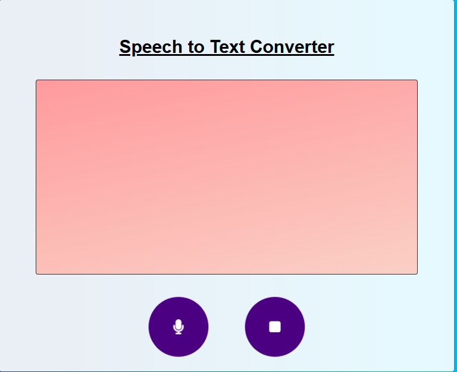

# 🎙️ Convertisseur Audio en Texte (Speech to Text)

Une application web simple permettant de convertir la parole en texte en temps réel à l'aide de l'API Web Speech (`webkitSpeechRecognition`).

## 🚀 Démo

Cliquez sur le bouton microphone 🎤, parlez, et observez le texte s'afficher en temps réel. Cliquez sur le bouton stop 🛑 pour arrêter la reconnaissance vocale.

---

## 📸 Aperçu

 <!-- Tu peux remplacer par une capture d’écran de ton app -->

---

## 🛠️ Fonctionnalités

- 🔊 **Reconnaissance vocale en temps réel**
- 📝 Affichage du **texte transcrit** (final et intermédiaire)
- 🎛️ **Boutons intuitifs** pour démarrer et arrêter l'enregistrement
- 🌐 Prise en charge de la langue **Anglais (en-US)** (modifiable)
- 💡 **Interface légère**, 100% front-end, sans backend

---

## 🧰 Technologies utilisées

- **HTML5** – structure de la page
- **CSS3** – mise en page et design
- **JavaScript Vanilla** – logique de reconnaissance vocale
- **Font Awesome** – icônes (microphone, stop)

## 📂 Structure du projet

